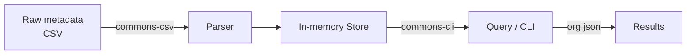
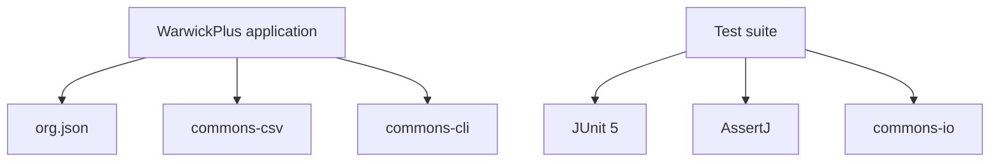
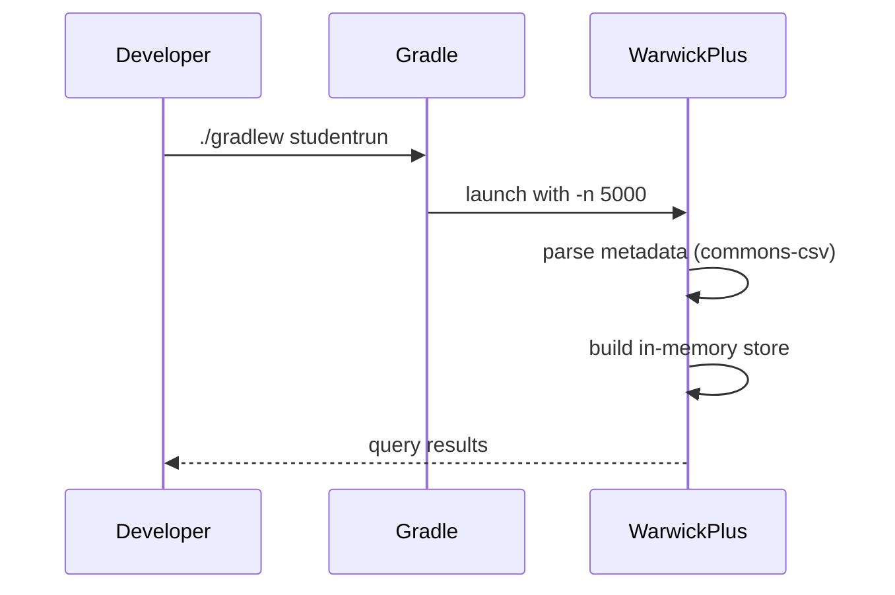
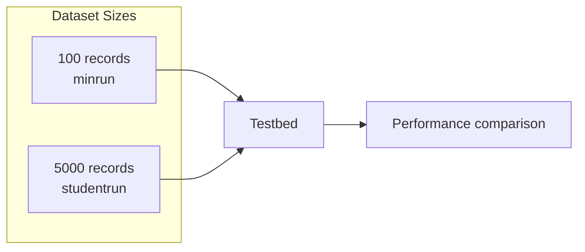

# Java Film Metadata Retrieval System

A Java coursework project (University of Warwick, **CS126**) that ingests film/programme metadata and provides fast, queryable in-memory storage over it — built and benchmarked with Gradle.

<p align="center">
  
  
  
  
</p>

---

## Overview

This project reads structured film/programme metadata and loads it into memory so it can be queried and retrieved efficiently. It's built as a Gradle **application**, with a benchmarking harness included to compare how the system performs across different dataset sizes.



## Project Structure

| Path | Purpose |
|---|---|
| `src/` | Java source (main application + tests) |
| `build.gradle` | Gradle build config, dependencies, and run tasks |
| `settings.gradle` | Gradle project settings |
| `gradlew` / `gradlew.bat` | Gradle wrapper (Linux/macOS and Windows) |
| `gradle.properties` | Gradle environment properties |
| `CS126_report.pdf` | Written coursework report accompanying the code |
| `Professor Feedback.pdf` | Instructor feedback on the submission |

## Dependencies

Pulled straight from `build.gradle`:

| Library | Role |
|---|---|
| `org.json:json` | JSON parsing/serialization |
| `org.apache.commons:commons-csv` | Reading structured CSV metadata |
| `commons-cli:commons-cli` | Command-line argument parsing |
| `org.junit.jupiter` (API, params, engine) | Unit testing (JUnit 5) |
| `org.assertj:assertj-core` | Fluent test assertions |
| `commons-io:commons-io` | Test/IO helper utilities |



## Entry Points & Gradle Tasks

The build defines several runnable configurations, each pointed at a different main class:

| Gradle Task | Main Class | Purpose |
|---|---|---|
| `run` (default, via `application` plugin) | `WarwickPlus` | Primary application entry point |
| `studentrun` | `WarwickPlus` | Runs with `-n 5000` — a large dataset for full-scale testing |
| `minrun` | `WarwickPlus` | Runs with `-n 100` — a small dataset for quick checks |
| `examplerun` | `RunWithExampleStores` | Runs against example/reference store implementations |
| `Testbed` | `Testbed` | Performance/behavior benchmarking harness |



## Benchmarking Approach

The presence of both a **`minrun`** (100 records) and **`studentrun`** (5000 records) task, alongside a dedicated **`Testbed`** class, points to this project comparing storage/retrieval performance across dataset scales — a common focus in CS126 coursework, where multiple data-structure implementations of the same interface are benchmarked against each other for correctness and speed.



## Requirements

- JDK compatible with Gradle 7.x (per the generated `build.gradle` header)
- No manual Gradle install needed — the wrapper (`gradlew`) handles it

## Building & Running

```bash
# Run the main application
./gradlew run

# Run against the full 5000-record dataset
./gradlew studentrun

# Run against a small 100-record dataset
./gradlew minrun

# Run with the provided example store implementations
./gradlew examplerun

# Run the benchmarking testbed
./gradlew Testbed

# Run the test suite
./gradlew test
```

On Windows, substitute `gradlew.bat` for `./gradlew`.

## Documentation

- **`CS126_report.pdf`** — the written report describing the design and evaluation of the system
- **`Professor Feedback.pdf`** — instructor feedback on the submitted coursework

---
