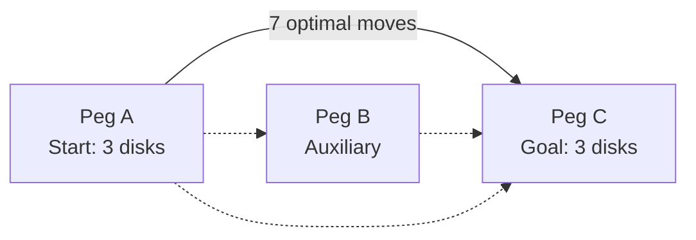
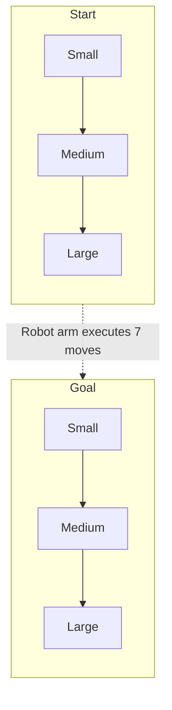
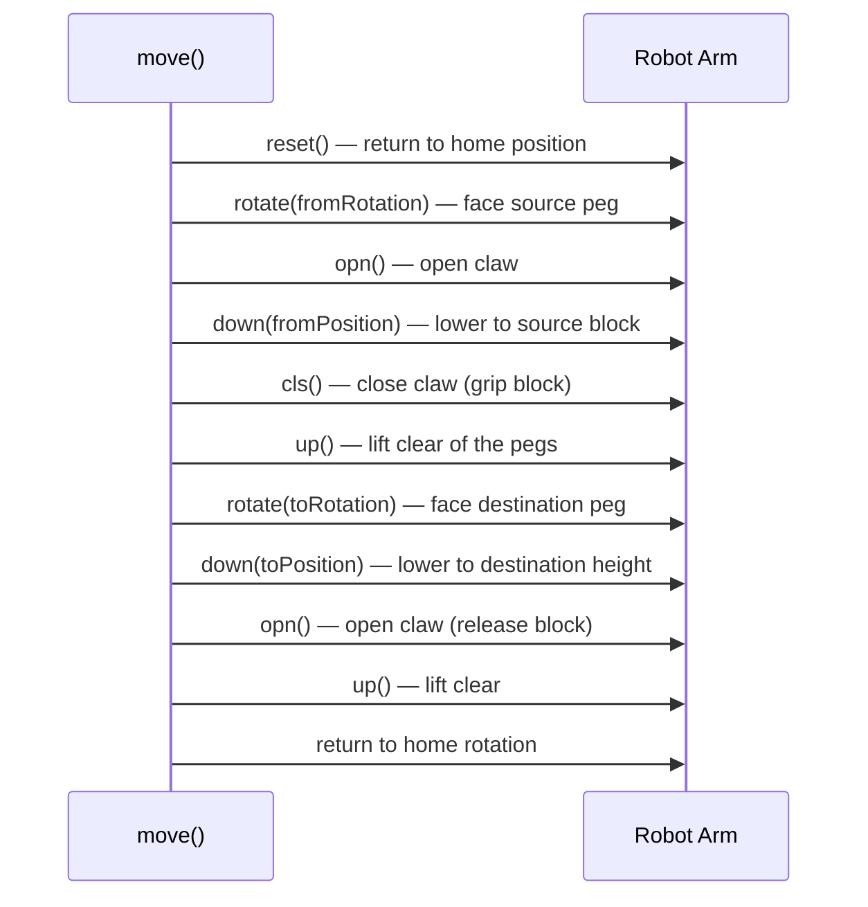
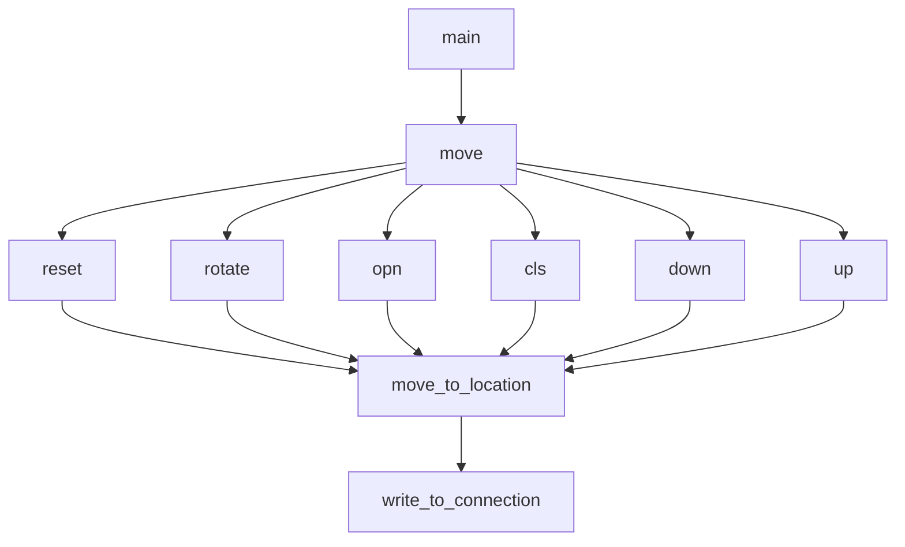
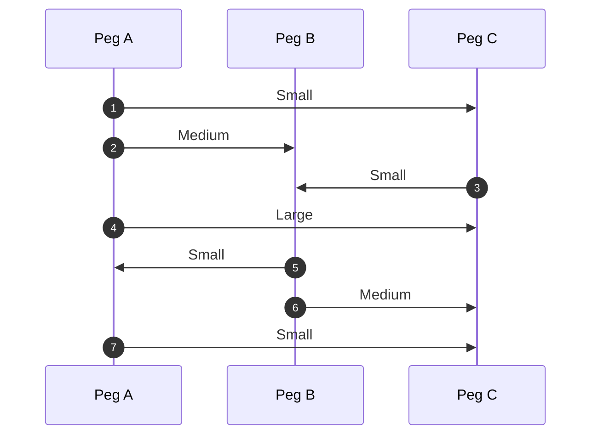

# Towers of Hanoi — Solved by a Robot Arm

A Dynamixel servo-driven robotic arm that physically solves the classic **Towers of Hanoi** puzzle — picking up, moving, and stacking real blocks across three pegs using the optimal 7-move solution for a 3-disk tower.

<p align="center">
  
  
  
  
</p>

---

## Overview

This project drives a 5-motor Dynamixel robot arm over a USB serial connection to autonomously solve Towers of Hanoi with 3 disks. The arm rotates between three fixed positions (the three "pegs"), and lowers to three fixed heights (the three "block levels"), executing a scripted pick-and-place routine for each move in the classic recursive solution.



## The Puzzle

Towers of Hanoi with **n = 3 disks** requires a minimum of **2ⁿ − 1 = 7 moves** to transfer the whole stack from the start peg to the goal peg, using the third peg as auxiliary storage — never placing a larger disk on a smaller one.



## Hardware Mapping

The arm has **5 Dynamixel servos**, each addressed by ID over the serial bus. Their roles, inferred directly from `Final Code.c`:

| Motor ID | Joint | Function |
|:--:|---|---|
| `1` | Base / waist | **Rotation** — swings the arm to face Peg A, B, or C |
| `2` | Shoulder | Raises/lowers the arm to a target height |
| `3` | Elbow | Extends/retracts the forearm for reach |
| `4` | Wrist | Tilts the gripper for pickup/placement |
| `5` | Gripper | **Claw** — opens and closes to grab/release a block |

### Rotation positions (`rotate()`)

| Code | Peg |
|:--:|:--:|
| `0` | Peg A |
| `1` | Peg B |
| `2` | Peg C |

### Height positions (`down()`)

| Code | Meaning |
|:--:|---|
| `0` | Block resting on the table (bottom of stack) |
| `1` | Block resting on top of **one** other block |
| `2` | Block resting on top of **two** other blocks (top of a full stack) |

## Pick-and-Place Cycle

Every disk move calls `move(connection, fromHeight, toHeight, fromPeg, toPeg)`, which runs the same choreography each time:



## Function Call Graph



`move_to_location()` builds a raw Dynamixel AX-12 instruction packet (`0xFF 0xFF id length instr params checksum`) and writes it to the serial connection; `wait_until_done()` gives each motion time to complete before the next command is issued.

## The 7-Move Solution

`main()` fires off the same sequence a recursive Hanoi solver would produce for 3 disks (A → C, using B as auxiliary):

| # | Disk | From | To | `move()` call |
|:--:|:--:|:--:|:--:|---|
| 1 | Small | A | C | `move(conn, 2, 0, 0, 2)` |
| 2 | Medium | A | B | `move(conn, 1, 0, 0, 1)` |
| 3 | Small | C | B | `move(conn, 0, 1, 2, 1)` |
| 4 | Large | A | C | `move(conn, 0, 0, 0, 2)` |
| 5 | Small | B | A | `move(conn, 1, 0, 1, 0)` |
| 6 | Medium | B | C | `move(conn, 0, 1, 1, 2)` |
| 7 | Small | A | C | `move(conn, 0, 2, 0, 2)` |



## Requirements

- A Dynamixel AX-12–class robot arm with **5 servos**, wired for daisy-chained serial communication
- USB-to-serial adapter presenting as `/dev/ttyUSB0`
- A `dynamixel.h` library exposing `open_connection()` and `write_to_connection()`
- Linux with `gcc` and standard POSIX headers (`unistd.h`, `time.h`)
- Three blocks and a fixture defining Peg A / B / C positions within the arm's reach

## Building & Running

```bash
gcc -o hanoi "Final Code.c" -I. -ldynamixel
./hanoi
```

> The program opens a serial connection at `1,000,000` baud, then plays through the fixed 7-move routine above with no runtime input — stack the 3 blocks on Peg A before starting.

## Repository Contents

| File | Description |
|---|---|
| `Final Code.c` | Complete motor-control and move-sequencing program |
| `Professor Feedback.pdf` | Instructor feedback on the project |
| `README.md` | This file |

## Ideas for Extending This Project

- Generalize `main()` to a recursive Hanoi solver for **n** disks instead of a hardcoded 3-disk sequence
- Add position/limit sensing instead of fixed `usleep()` delays in `wait_until_done()`
- Support additional pegs or a variable number of blocks
- Log each move to the console with the peg/disk mapping shown above, for easier debugging
